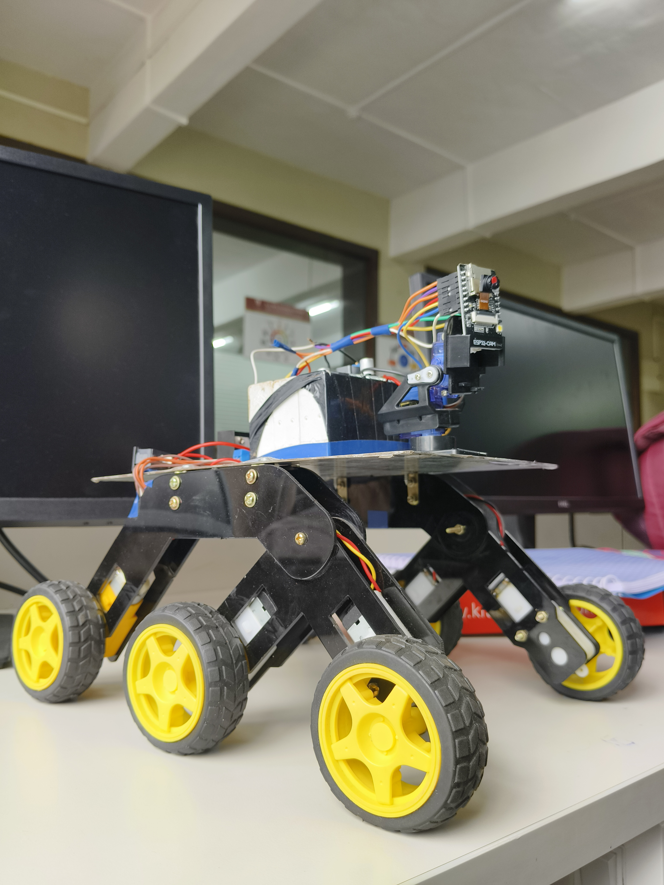

# Unmanned Space Mission – ESP32-CAM Space Rover

This project simulates an unmanned space exploration rover. Built using an **ESP32-CAM**, it can be remotely controlled over Wi-Fi, stream live video, and includes a **pan-tilt camera system** for enhanced surveillance and navigation.

## Features

- **ESP32-CAM live video streaming** over Wi-Fi
- **Pan-Tilt camera control** using servo motors
- **D-pad-style web control interface**
- **Adjustable speed and headlight brightness**
- Custom rover design with 6-wheel suspension

## Components Used

- ESP32-CAM
- L298N motor driver
- 4 DC motors (2 left + 2 right for skid-steer)
- 2 SG90 servo motors (for pan and tilt)
- UBEC/Buck converter (7–12V to 5V)
- 7–12V rechargeable battery pack
- Custom rover chassis

## Circuit Diagram

## Project Photo

## Video Demo

*Coming soon – will update with a link to Google Drive or YouTube*

## How It Works

- The rover hosts a **Wi-Fi Access Point** (SSID: `Unmanned Space Mission`)
- Control page loads through a web interface served by the ESP32
- You can:
  - Drive the rover using a virtual D-pad
  - Pan/tilt the camera
  - Adjust speed and light brightness
  - View real-time video

## Folder Structure (Suggested)

unmanned-space-mission/
│
├── Surveillance_Car_With_Pan_Tilt_Control.ino # Arduino code
├── circuit-diagram.png # Schematic
├── rover-photo.jpg # Physical build
├── README.md # This file
